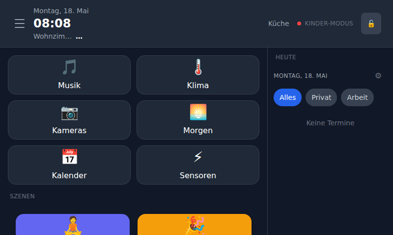
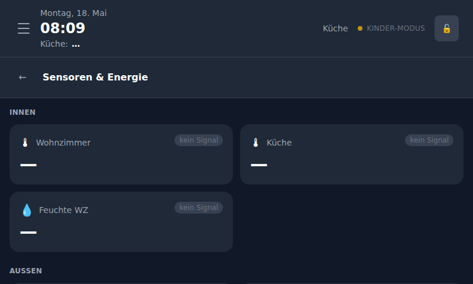
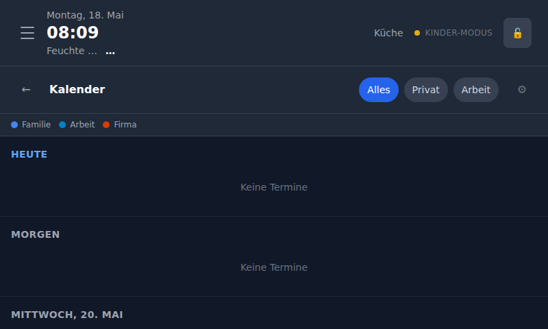
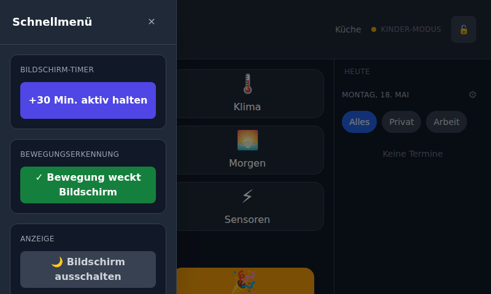

# Dokumentation — Smart Home Dashboard RPi

Alle Anleitungen und Referenzen für das Raspberry Pi 5 Kiosk-Dashboard.

## Übersicht

| Datei | Inhalt |
|-------|--------|
| [setup.md](setup.md) | Vollständige Einrichtungsanleitung (RPi + Zentralserver) |
| [panel-config.md](panel-config.md) | Referenz für `panel.json` — alle Felder erklärt |
| [mqtt-topics.md](mqtt-topics.md) | Vollständige MQTT-Topic-Referenz |
| [sensors.md](sensors.md) | Sensor-Integration, Konfiguration, Grafana-Embeds |
| [weather.md](weather.md) | Wetter-Integration (Open-Meteo / MeteoSwiss ICON) |
| [calendar.md](calendar.md) | Kalender-Integration (Google, Nextcloud, Office 365) |
| [network.md](network.md) | Netzwerk-Profile, VPN, WiFi, LAN-Routing |
| [screenshots/](screenshots/) | UI-Screenshots (800×480, RPi 7" Touchscreen) |

## UI-Screenshots

Aufgenommen bei 800×480 px (RPi 7" Touchscreen).

| Screenshot | Beschreibung |
|-----------|-------------|
|  | Hauptmenü beim Start (kein MQTT) |
|  | Hauptmenü mit Wetter-Widget + Kalender-Sidebar |
|  | Sensor-Detailansicht mit Live-Werten |
|  | Wetter-Vollansicht (7-Tage-Forecast) |
|  | Kalender-Wochenansicht |
|  | Quick-Edge-Menü |
